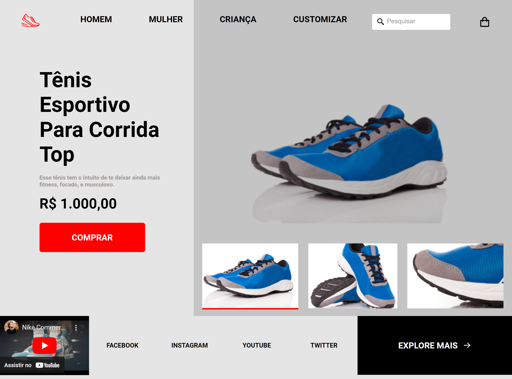

# RocketShoes

[Clique aqui para acessar](https://maik-emanoel.github.io/RocketShoes/)

## Contando um pouco sobre o projeto

  Projeto feito a partir do layout disponibilizado na área de desafios do programa Discover da Rocketseat. Contudo, adicionei novas funcionalidades, como a opção de clicar na imagem e ela ser visualizada com um tamanho maior no visualizador de imagens, novas animações e efeitos "hover" e também tornei o layout totalmente responsivo, fazendo com que o site se adapte para qualquer tamanho de tela.

## Tecnologias utilizadas no projeto:

- HTML
- CSS
- JavaScript